# Database Relationship Map

## Core Entity Diagram

```mermaid
erDiagram
    AC_BEHAVIOR }|..|| AC_SITE : "SITE"
    AC_BEHAVIOR_DAYS }|..|| AC_FEEDBACK : "BEHAVIOR_FBK"
    AC_BEHAVIOR_FLOOR_MAP }|..|| AC_FLOOR_MAP : "MAP_ID"
    AC_BEHAVIOR_TERMINALS }|..|| SY_OBJECT : "TERMINAL_KEY"
    AC_BEHAVIOR_TIMEPERIODS }|..|| AC_TIMEPERIOD : "TIMEPERIOD"
    AC_CARD_RANGE }|..|| AC_SGR_GROUP : "SGR_GROUP_ID"
    AC_CARD_RANGE }|..|| AC_LAYOUT : "LAYOUT_ID"
    AC_CARD_RANGE_SITE }|..|| AC_SITE : "SITE"
    AC_CARD_RANGE_SITE }|..|| AC_CARD_RANGE : "RANGE_ID"
    AC_CARD_RANGE_SITE }|..|| AC_CARD_RANGE : "SERVER_ID"
    AC_CARD_RANGE_SITE_ALTBEHAVIOR }|..|| AC_CARD_RANGE : "SERVER_ID"
    AC_CARD_RANGE_SITE_ALTBEHAVIOR }|..|| AC_CARD_RANGE : "RANGE_ID"
    AC_CARD_RANGE_SITE_ALTBEHAVIOR }|..|| AC_BEHAVIOR : "SERVER_ID"
    AC_CARD_RANGE_SITE_ALTBEHAVIOR }|..|| AC_BEHAVIOR : "BEHAVIOR_ID"
    AC_CARD_RANGE_SITE_BEHAVIOR }|..|| AC_BEHAVIOR : "BEHAVIOR_ID"
    AC_CARD_RANGE_SITE_BEHAVIOR }|..|| AC_BEHAVIOR : "SERVER_ID"
    AC_CARD_RANGE_SITE_BEHAVIOR }|..|| AC_CARD_RANGE : "RANGE_ID"
    AC_CARD_RANGE_SITE_BEHAVIOR }|..|| AC_CARD_RANGE : "SERVER_ID"
    AC_CLASS_VALUES }|..|| AC_CLASS : "CLASS_ID"
    AC_CLASS_VALUES }|..|| AC_CLASS : "SBI_TYPE"
    AC_CTU_CFG }|..|| AC_FEEDBACK : "TAMPER_FBK"
    AC_CTU_CFG }|..|| AC_FEEDBACK : "TAMPER_RESUME_FBK"
    AC_CTU_CFG }|..|| AC_FEEDBACK : "BEF_ASIDE_FBK"
    AC_CTU_CFG }|..|| AC_FEEDBACK : "AFT_ASIDE_FBK"
    AC_CTU_CFG }|..|| AC_FEEDBACK : "BEF_NORMAL_FBK"
    AC_CTU_CFG }|..|| AC_FEEDBACK : "AFT_NORMAL_FBK"
    AC_CTU_CFG }|..|| AC_FEEDBACK : "AFT_OVERLOAD_FBK"
    AC_CTU_CFG }|..|| MG_FORMAT : "FORMAT_ID"
    AC_CTU_CFG }|..|| SY_OBJECT : "CTU_KEY"
    AC_CTU_CFG }|..|| AC_SITE : "SITE"
    AC_CTU_CFG }|..|| AC_FEEDBACK : "BEF_OVERLOAD_FBK"
    AC_DIGITAL_INPUT }|..|| AC_SITE : "SITE"
    AC_DIGITAL_INPUT }|..|| SY_OBJECT : "INPUT_KEY"
    AC_DIGITAL_INPUT }|..|| SY_OBJECT : "RTU_KEY"
    AC_DIGITAL_INPUT }|..|| AC_ZONE : "ZONE_KEY"
    AC_DIGITAL_INPUT }|..|| AC_FEEDBACK : "ACTIVATE_FBK"
    AC_DIGITAL_INPUT }|..|| AC_FEEDBACK : "ARM_FBK"
    AC_DIGITAL_INPUT }|..|| AC_FEEDBACK : "DISARM_FBK"
    AC_DIGITAL_INPUT }|..|| AC_FEEDBACK : "CUT_FBK"
    AC_DIGITAL_INPUT }|..|| AC_FEEDBACK : "CUT_RESUME_FBK"
    AC_DIGITAL_INPUT }|..|| AC_FEEDBACK : "SHORT_FBK"
    AC_DIGITAL_INPUT }|..|| AC_FEEDBACK : "SHORT_RESUME_FBK"
    AC_DIGITAL_INPUT }|..|| AC_FEEDBACK : "DEACTIVATE_FBK"
    AC_DIGITAL_INPUT }|..|| AC_FEEDBACK : "TAMPER_FBK"
    AC_DIGITAL_INPUT }|..|| AC_FEEDBACK : "TAMPER_RET_FBK"
    AC_DIGITAL_OUTPUT }|..|| AC_FEEDBACK : "CUT_FBK"
    AC_DIGITAL_OUTPUT }|..|| AC_FEEDBACK : "CUT_RESUME_FBK"
    AC_DIGITAL_OUTPUT }|..|| AC_FEEDBACK : "SHORT_FBK"
    AC_DIGITAL_OUTPUT }|..|| AC_FEEDBACK : "SHORT_RESUME_FBK"
    AC_DIGITAL_OUTPUT }|..|| AC_ZONE : "ZONE_KEY"
    AC_DIGITAL_OUTPUT }|..|| SY_OBJECT : "OUTPUT_KEY"
    AC_DIGITAL_OUTPUT }|..|| SY_OBJECT : "RTU_KEY"
    AC_DIGITAL_OUTPUT }|..|| AC_SITE : "SITE"
    AC_ENQUIRY_DATA }|..|| AC_ENQUIRY : "ENQUIRY_KEY"
    AC_ENQUIRY_FIELD }|..|| AC_ENQUIRY : "ENQUIRY_KEY"
    AC_ENQUIRY_ZONE }|..|| AC_ZONE : "ZONE_KEY"
    AC_FEEDBACK }|..|| AC_SITE : "SITE"
    AC_FEEDBACK }|..|| AC_FEEDBACK : "NEXT_FBK"
    AC_FEEDBACK_CMD }|..|| AC_FEEDBACK : "FEEDBACK_ID"
    AC_FEEDBACK_CMD }|..|| SY_OBJECT : "OBJECT_KEY"
    AC_FLOOR_MAP }|..|| AC_LIFT : "LIFT_KEY"
    AC_FLOOR_MAP_CFG }|..|| AC_FLOOR_MAP : "MAP_ID"
    AC_LAYOUT_PLANT_CODE }|..|| AC_LAYOUT : "LAYOUT_ID"
    AC_LIFT }|..|| AC_SITE : "SITE"
    AC_LIFT }|..|| AC_VTERMINAL : "TERMINAL_KEY"
    AC_LIFT }|..|| AC_CTU_CFG : "CTU_KEY"
    AC_LIFT }|..|| AC_FEEDBACK : "COMMUNICATION_FBK"
    AC_LIFT }|..|| AC_FEEDBACK : "COMMUNICATION_RET_FBK"
    AC_LIFT }|..|| AC_FEEDBACK : "POWER_FBK"
    AC_LIFT }|..|| AC_FEEDBACK : "POWER_RET_FBK"
    AC_LIFT }|..|| AC_FEEDBACK : "FIRE_FBK"
    AC_LIFT }|..|| AC_FEEDBACK : "INDIPENDENT_FBK"
    AC_LIFT }|..|| AC_FEEDBACK : "START_FBK"
    AC_LIFT }|..|| AC_FEEDBACK : "EMERGENCY_FBK"
    AC_LIFT }|..|| AC_FEEDBACK : "EMERGENCY_RET_FBK"
    AC_LIFT }|..|| AC_FEEDBACK : "CAR_ALARM_FBK"
    AC_LIFT }|..|| AC_FEEDBACK : "CAR_ALARM_RET_FBK"
    AC_LIFT }|..|| AC_FEEDBACK : "SECURE_MODE_FBK"
    AC_LIFT }|..|| AC_FEEDBACK : "ACCESS_MODE_FBK"
    AC_LIFT }|..|| AC_FEEDBACK : "LIGHT_MODE_FBK"
    AC_LIFT_FLOOR }|..|| AC_LIFT : "LIFT_KEY"
    AC_MENU_ITEM }|..|| AC_MENU : "MENU_KEY"
    AC_MENU_ITEM }|..|| AC_ADL : "ADL_KEY"
    AC_MENU_ITEM }|..|| AC_TCATEGORY : "TCATEGORY_KEY"
    AC_MENU_ITEM }|..|| AC_REASON : "REASON_KEY"
    AC_MENU_ITEM }|..|| AC_ENQUIRY : "ENQUIRY_KEY"
    AC_POBJECT }|..|| AC_ENQUIRY : "ENQUIRY"
    AC_POBJECT }|..|| AC_ENQUIRY : "ENQUIRY_KEY"
    AC_POBJECT }|..|| AC_REASON : "REASON_KEY"
    AC_POBJECT }|..|| AC_TCATEGORY : "TCATEGORY_KEY"
    AC_POBJECT_FKEY }|..|| AC_TCATEGORY : "TCATEGORY_KEY"
    AC_POBJECT_FKEY }|..|| AC_ADL : "ADL_KEY"
    AC_POBJECT_FKEY }|..|| AC_MENU : "MENU_KEY"
    AC_POBJECT_FKEY }|..|| AC_POBJECT : "POBJECT_ID"
    AC_POBJECT_FKEY }|..|| AC_REASON : "REASON_KEY"
    AC_POBJECT_FKEY }|..|| AC_ENQUIRY : "ENQUIRY_KEY"
    AC_POBJECT_ROW }|..|| AC_POBJECT : "POBJECT_ID"
    AC_PRE_VISIT }|..|| AC_SITE : "SITE"
    AC_REASON }|..|| AC_FEEDBACK : "FEEDBACK"
    AC_RTU_CFG }|..|| AC_FEEDBACK : "TAMPER_FBK"
    AC_RTU_CFG }|..|| AC_FEEDBACK : "TAMPER_RESUME_FBK"
```

## Full Relationship List

| From Table | Column | To Table | Column | Type |
| --- | --- | --- | --- | --- |
| AC_BEHAVIOR | SITE | AC_SITE | SITE | FK |
| AC_BEHAVIOR_DAYS | BEHAVIOR_FBK | AC_FEEDBACK | FEEDBACK_ID | FK |
| AC_BEHAVIOR_FLOOR_MAP | MAP_ID | AC_FLOOR_MAP | MAP_ID | FK |
| AC_BEHAVIOR_TERMINALS | TERMINAL_KEY | SY_OBJECT | OBJECT | FK |
| AC_BEHAVIOR_TIMEPERIODS | TIMEPERIOD | AC_TIMEPERIOD | TIMEPERIOD_ID | FK |
| AC_CARD_RANGE | SGR_GROUP_ID | AC_SGR_GROUP | GROUP_ID | FK |
| AC_CARD_RANGE | LAYOUT_ID | AC_LAYOUT | LAYOUT_ID | FK |
| AC_CARD_RANGE_SITE | SITE | AC_SITE | SITE | FK |
| AC_CARD_RANGE_SITE | RANGE_ID | AC_CARD_RANGE | RANGE_ID | FK |
| AC_CARD_RANGE_SITE | SERVER_ID | AC_CARD_RANGE | SERVER_ID | FK |
| AC_CARD_RANGE_SITE_ALTBEHAVIOR | SERVER_ID | AC_CARD_RANGE | SERVER_ID | FK |
| AC_CARD_RANGE_SITE_ALTBEHAVIOR | RANGE_ID | AC_CARD_RANGE | RANGE_ID | FK |
| AC_CARD_RANGE_SITE_ALTBEHAVIOR | SERVER_ID | AC_BEHAVIOR | SERVER_ID | FK |
| AC_CARD_RANGE_SITE_ALTBEHAVIOR | BEHAVIOR_ID | AC_BEHAVIOR | BEHAVIOR_ID | FK |
| AC_CARD_RANGE_SITE_BEHAVIOR | BEHAVIOR_ID | AC_BEHAVIOR | BEHAVIOR_ID | FK |
| AC_CARD_RANGE_SITE_BEHAVIOR | SERVER_ID | AC_BEHAVIOR | SERVER_ID | FK |
| AC_CARD_RANGE_SITE_BEHAVIOR | RANGE_ID | AC_CARD_RANGE | RANGE_ID | FK |
| AC_CARD_RANGE_SITE_BEHAVIOR | SERVER_ID | AC_CARD_RANGE | SERVER_ID | FK |
| AC_CLASS_VALUES | CLASS_ID | AC_CLASS | CLASS_ID | FK |
| AC_CLASS_VALUES | SBI_TYPE | AC_CLASS | SBI_TYPE | FK |
| AC_CTU_CFG | TAMPER_FBK | AC_FEEDBACK | FEEDBACK_ID | FK |
| AC_CTU_CFG | TAMPER_RESUME_FBK | AC_FEEDBACK | FEEDBACK_ID | FK |
| AC_CTU_CFG | BEF_ASIDE_FBK | AC_FEEDBACK | FEEDBACK_ID | FK |
| AC_CTU_CFG | AFT_ASIDE_FBK | AC_FEEDBACK | FEEDBACK_ID | FK |
| AC_CTU_CFG | BEF_NORMAL_FBK | AC_FEEDBACK | FEEDBACK_ID | FK |
| AC_CTU_CFG | AFT_NORMAL_FBK | AC_FEEDBACK | FEEDBACK_ID | FK |
| AC_CTU_CFG | AFT_OVERLOAD_FBK | AC_FEEDBACK | FEEDBACK_ID | FK |
| AC_CTU_CFG | FORMAT_ID | MG_FORMAT | FORMAT_ID | FK |
| AC_CTU_CFG | CTU_KEY | SY_OBJECT | OBJECT | FK |
| AC_CTU_CFG | SITE | AC_SITE | SITE | FK |
| AC_CTU_CFG | BEF_OVERLOAD_FBK | AC_FEEDBACK | FEEDBACK_ID | FK |
| AC_DIGITAL_INPUT | SITE | AC_SITE | SITE | FK |
| AC_DIGITAL_INPUT | INPUT_KEY | SY_OBJECT | OBJECT | FK |
| AC_DIGITAL_INPUT | RTU_KEY | SY_OBJECT | OBJECT | FK |
| AC_DIGITAL_INPUT | ZONE_KEY | AC_ZONE | ZONE_KEY | FK |
| AC_DIGITAL_INPUT | ACTIVATE_FBK | AC_FEEDBACK | FEEDBACK_ID | FK |
| AC_DIGITAL_INPUT | ARM_FBK | AC_FEEDBACK | FEEDBACK_ID | FK |
| AC_DIGITAL_INPUT | DISARM_FBK | AC_FEEDBACK | FEEDBACK_ID | FK |
| AC_DIGITAL_INPUT | CUT_FBK | AC_FEEDBACK | FEEDBACK_ID | FK |
| AC_DIGITAL_INPUT | CUT_RESUME_FBK | AC_FEEDBACK | FEEDBACK_ID | FK |
| AC_DIGITAL_INPUT | SHORT_FBK | AC_FEEDBACK | FEEDBACK_ID | FK |
| AC_DIGITAL_INPUT | SHORT_RESUME_FBK | AC_FEEDBACK | FEEDBACK_ID | FK |
| AC_DIGITAL_INPUT | DEACTIVATE_FBK | AC_FEEDBACK | FEEDBACK_ID | FK |
| AC_DIGITAL_INPUT | TAMPER_FBK | AC_FEEDBACK | FEEDBACK_ID | FK |
| AC_DIGITAL_INPUT | TAMPER_RET_FBK | AC_FEEDBACK | FEEDBACK_ID | FK |
| AC_DIGITAL_OUTPUT | CUT_FBK | AC_FEEDBACK | FEEDBACK_ID | FK |
| AC_DIGITAL_OUTPUT | CUT_RESUME_FBK | AC_FEEDBACK | FEEDBACK_ID | FK |
| AC_DIGITAL_OUTPUT | SHORT_FBK | AC_FEEDBACK | FEEDBACK_ID | FK |
| AC_DIGITAL_OUTPUT | SHORT_RESUME_FBK | AC_FEEDBACK | FEEDBACK_ID | FK |
| AC_DIGITAL_OUTPUT | ZONE_KEY | AC_ZONE | ZONE_KEY | FK |
| AC_DIGITAL_OUTPUT | OUTPUT_KEY | SY_OBJECT | OBJECT | FK |
| AC_DIGITAL_OUTPUT | RTU_KEY | SY_OBJECT | OBJECT | FK |
| AC_DIGITAL_OUTPUT | SITE | AC_SITE | SITE | FK |
| AC_ENQUIRY_DATA | ENQUIRY_KEY | AC_ENQUIRY | ENQUIRY_KEY | FK |
| AC_ENQUIRY_FIELD | ENQUIRY_KEY | AC_ENQUIRY | ENQUIRY_KEY | FK |
| AC_ENQUIRY_ZONE | ZONE_KEY | AC_ZONE | ZONE_KEY | FK |
| AC_FEEDBACK | SITE | AC_SITE | SITE | FK |
| AC_FEEDBACK | NEXT_FBK | AC_FEEDBACK | FEEDBACK_ID | FK |
| AC_FEEDBACK_CMD | FEEDBACK_ID | AC_FEEDBACK | FEEDBACK_ID | FK |
| AC_FEEDBACK_CMD | OBJECT_KEY | SY_OBJECT | OBJECT | FK |
| AC_FLOOR_MAP | LIFT_KEY | AC_LIFT | LIFT_KEY | FK |
| AC_FLOOR_MAP_CFG | MAP_ID | AC_FLOOR_MAP | MAP_ID | FK |
| AC_LAYOUT_PLANT_CODE | LAYOUT_ID | AC_LAYOUT | LAYOUT_ID | FK |
| AC_LIFT | SITE | AC_SITE | SITE | FK |
| AC_LIFT | TERMINAL_KEY | AC_VTERMINAL | VTERMINAL_KEY | FK |
| AC_LIFT | CTU_KEY | AC_CTU_CFG | CTU_KEY | FK |
| AC_LIFT | COMMUNICATION_FBK | AC_FEEDBACK | FEEDBACK_ID | FK |
| AC_LIFT | COMMUNICATION_RET_FBK | AC_FEEDBACK | FEEDBACK_ID | FK |
| AC_LIFT | POWER_FBK | AC_FEEDBACK | FEEDBACK_ID | FK |
| AC_LIFT | POWER_RET_FBK | AC_FEEDBACK | FEEDBACK_ID | FK |
| AC_LIFT | FIRE_FBK | AC_FEEDBACK | FEEDBACK_ID | FK |
| AC_LIFT | INDIPENDENT_FBK | AC_FEEDBACK | FEEDBACK_ID | FK |
| AC_LIFT | START_FBK | AC_FEEDBACK | FEEDBACK_ID | FK |
| AC_LIFT | EMERGENCY_FBK | AC_FEEDBACK | FEEDBACK_ID | FK |
| AC_LIFT | EMERGENCY_RET_FBK | AC_FEEDBACK | FEEDBACK_ID | FK |
| AC_LIFT | CAR_ALARM_FBK | AC_FEEDBACK | FEEDBACK_ID | FK |
| AC_LIFT | CAR_ALARM_RET_FBK | AC_FEEDBACK | FEEDBACK_ID | FK |
| AC_LIFT | SECURE_MODE_FBK | AC_FEEDBACK | FEEDBACK_ID | FK |
| AC_LIFT | ACCESS_MODE_FBK | AC_FEEDBACK | FEEDBACK_ID | FK |
| AC_LIFT | LIGHT_MODE_FBK | AC_FEEDBACK | FEEDBACK_ID | FK |
| AC_LIFT_FLOOR | LIFT_KEY | AC_LIFT | LIFT_KEY | FK |
| AC_MENU_ITEM | MENU_KEY | AC_MENU | MENU_KEY | FK |
| AC_MENU_ITEM | ADL_KEY | AC_ADL | ADL_KEY | FK |
| AC_MENU_ITEM | TCATEGORY_KEY | AC_TCATEGORY | TCATEGORY_KEY | FK |
| AC_MENU_ITEM | REASON_KEY | AC_REASON | PERIPHERAL_KEY | FK |
| AC_MENU_ITEM | ENQUIRY_KEY | AC_ENQUIRY | ENQUIRY_KEY | FK |
| AC_POBJECT | ENQUIRY | AC_ENQUIRY | ENQUIRY_KEY | FK |
| AC_POBJECT | ENQUIRY_KEY | AC_ENQUIRY | ENQUIRY_KEY | FK |
| AC_POBJECT | REASON_KEY | AC_REASON | PERIPHERAL_KEY | FK |
| AC_POBJECT | TCATEGORY_KEY | AC_TCATEGORY | TCATEGORY_KEY | FK |
| AC_POBJECT_FKEY | TCATEGORY_KEY | AC_TCATEGORY | TCATEGORY_KEY | FK |
| AC_POBJECT_FKEY | ADL_KEY | AC_ADL | ADL_KEY | FK |
| AC_POBJECT_FKEY | MENU_KEY | AC_MENU | MENU_KEY | FK |
| AC_POBJECT_FKEY | POBJECT_ID | AC_POBJECT | POBJECT_ID | FK |
| AC_POBJECT_FKEY | REASON_KEY | AC_REASON | PERIPHERAL_KEY | FK |
| AC_POBJECT_FKEY | ENQUIRY_KEY | AC_ENQUIRY | ENQUIRY_KEY | FK |
| AC_POBJECT_ROW | POBJECT_ID | AC_POBJECT | POBJECT_ID | FK |
| AC_PRE_VISIT | SITE | AC_SITE | SITE | FK |
| AC_REASON | FEEDBACK | AC_FEEDBACK | FEEDBACK_ID | FK |
| AC_RTU_CFG | TAMPER_FBK | AC_FEEDBACK | FEEDBACK_ID | FK |
| AC_RTU_CFG | TAMPER_RESUME_FBK | AC_FEEDBACK | FEEDBACK_ID | FK |
| AC_RTU_CFG | CTU_KEY | AC_CTU_CFG | CTU_KEY | FK |
| AC_RTU_CFG | SITE | AC_SITE | SITE | FK |
| AC_RTU_CFG | LAYOUT_ID | AC_LAYOUT | LAYOUT_ID | FK |
| AC_RTU_CFG | RTU_KEY | SY_OBJECT | OBJECT | FK |
| AC_RTU_CFG | TERMINAL_KEY | AC_VTERMINAL | VTERMINAL_KEY | FK |
| AC_SCHEDULED_CMD | CTU_START | SY_OBJECT | OBJECT | FK |
| AC_SCHEDULED_CMD | FBK_IN | AC_FEEDBACK | FEEDBACK_ID | FK |
| AC_SCHEDULED_CMD | FBK_OUT | AC_FEEDBACK | FEEDBACK_ID | FK |
| AC_SESAMO_DEVICE | TAMPER_FBK | AC_FEEDBACK | FEEDBACK_ID | FK |
| AC_SESAMO_DEVICE | TAMPER_RESUME_FBK | AC_FEEDBACK | FEEDBACK_ID | FK |
| AC_SESAMO_DEVICE | DEGRADED_FBK | AC_FEEDBACK | FEEDBACK_ID | FK |
| AC_SESAMO_DEVICE | DEGRADED_RESUME_FBK | AC_FEEDBACK | FEEDBACK_ID | FK |
| AC_SESAMO_DEVICE | STARTUP_FBK | AC_FEEDBACK | FEEDBACK_ID | FK |
| AC_SESAMO_DEVICE | CTU_KEY | SY_OBJECT | OBJECT | FK |
| AC_SESAMO_DEVICE | POBJECT_ID | AC_POBJECT | POBJECT_ID | FK |
| AC_SESAMO_DEVICE | CREDENTIAL_ID1 | AC_LAYOUT | LAYOUT_ID | FK |
| AC_SESAMO_DEVICE | CREDENTIAL_ID2 | AC_LAYOUT | LAYOUT_ID | FK |
| AC_SESAMO_DEVICE | SITE | AC_SITE | SITE | FK |
| AC_SESAMO_DEVICE | FORMAT_ID | MG_FORMAT | FORMAT_ID | FK |
| AC_SESAMO_DOOR | ARRIVAL_ZONE | AC_ZONE | ZONE_KEY | FK |
| AC_SESAMO_DOOR | DEPARTURE_ZONE | AC_ZONE | ZONE_KEY | FK |
| AC_SESAMO_DOOR | SITE | AC_SITE | SITE | FK |
| AC_SESAMO_DOOR | SPECIAL_OK2_FBK | AC_FEEDBACK | FEEDBACK_ID | FK |
| AC_SESAMO_DOOR | DOOR_ID | SY_OBJECT | OBJECT | FK |
| AC_SESAMO_DOOR | ACCESS_DENIED_FBK | AC_FEEDBACK | FEEDBACK_ID | FK |
| AC_SESAMO_DOOR | ENTRY_ACCESS_GRANTED_FBK | AC_FEEDBACK | FEEDBACK_ID | FK |
| AC_SESAMO_DOOR | EXIT_ACCESS_GRANTED_FBK | AC_FEEDBACK | FEEDBACK_ID | FK |
| AC_SESAMO_DOOR | BUSY_IN_FBK | AC_FEEDBACK | FEEDBACK_ID | FK |
| AC_SESAMO_DOOR | BUSY_OUT_FBK | AC_FEEDBACK | FEEDBACK_ID | FK |
| AC_SESAMO_DOOR | GATE_END_BUSY_FBK | AC_FEEDBACK | FEEDBACK_ID | FK |
| AC_SESAMO_DOOR | NOT_SHUT_FBK | AC_FEEDBACK | FEEDBACK_ID | FK |
| AC_SESAMO_DOOR | CROSSING_FBK | AC_FEEDBACK | FEEDBACK_ID | FK |
| AC_SESAMO_DOOR | FORCED_FBK | AC_FEEDBACK | FEEDBACK_ID | FK |
| AC_SESAMO_DOOR | EMERGENCY_FBK | AC_FEEDBACK | FEEDBACK_ID | FK |
| AC_SESAMO_DOOR | REQ_EXIT_FBK | AC_FEEDBACK | FEEDBACK_ID | FK |
| AC_SESAMO_DOOR | ACCESS_GRANTED_FBK | AC_FEEDBACK | FEEDBACK_ID | FK |
| AC_SESAMO_DOOR | OUT_ACCESS_GRANTED_FBK | AC_FEEDBACK | FEEDBACK_ID | FK |
| AC_SESAMO_DOOR | UNDER_DURESS_FBK | AC_FEEDBACK | FEEDBACK_ID | FK |
| AC_SESAMO_DOOR | NOT_HAPPENED_FBK | AC_FEEDBACK | FEEDBACK_ID | FK |
| AC_SESAMO_DOOR | GATE_OPEN_FBK | AC_FEEDBACK | FEEDBACK_ID | FK |
| AC_SESAMO_DOOR | GATE_CLOSE_FBK | AC_FEEDBACK | FEEDBACK_ID | FK |
| AC_SESAMO_DOOR | NOT_SHUT_RETURN_FBK | AC_FEEDBACK | FEEDBACK_ID | FK |
| AC_SESAMO_DOOR | CROSSING_RESUME_FBK | AC_FEEDBACK | FEEDBACK_ID | FK |
| AC_SESAMO_DOOR | FORCED_RESUME_FBK | AC_FEEDBACK | FEEDBACK_ID | FK |
| AC_SESAMO_DOOR | EMERGENCY_RESET_FBK | AC_FEEDBACK | FEEDBACK_ID | FK |
| AC_SESAMO_DOOR | TIME_PERIOD_OK_FBK | AC_FEEDBACK | FEEDBACK_ID | FK |
| AC_SESAMO_DOOR | TIME_PERIOD_KO_FBK | AC_FEEDBACK | FEEDBACK_ID | FK |
| AC_SESAMO_DOOR | BEHAVIOR_OK_FBK | AC_FEEDBACK | FEEDBACK_ID | FK |
| AC_SESAMO_DOOR | BEHAVIOR_KO_FBK | AC_FEEDBACK | FEEDBACK_ID | FK |
| AC_SESAMO_DOOR | AUTHORIZED_FUNCTION_OK_FBK | AC_FEEDBACK | FEEDBACK_ID | FK |
| AC_SESAMO_DOOR | AUTHORIZED_FUNCTION_KO_FBK | AC_FEEDBACK | FEEDBACK_ID | FK |
| AC_SESAMO_DOOR | APB_OK_FBK | AC_FEEDBACK | FEEDBACK_ID | FK |
| AC_SESAMO_DOOR | APB_KO_FBK | AC_FEEDBACK | FEEDBACK_ID | FK |
| AC_SESAMO_DOOR | PATH_OK_FBK | AC_FEEDBACK | FEEDBACK_ID | FK |
| AC_SESAMO_DOOR | PATH_KO_FBK | AC_FEEDBACK | FEEDBACK_ID | FK |
| AC_SESAMO_DOOR | GT_FBK | AC_FEEDBACK | FEEDBACK_ID | FK |
| AC_SESAMO_DOOR | RANDOM_SEARCH_FBK | AC_FEEDBACK | FEEDBACK_ID | FK |
| AC_SESAMO_DOOR | MAX_IN_AREA_KO_FBK | AC_FEEDBACK | FEEDBACK_ID | FK |
| AC_SESAMO_DOOR | SECURITY_BLOCK_FBK | AC_FEEDBACK | FEEDBACK_ID | FK |
| AC_SESAMO_DOOR | MAX_IN_AREA_OK_FBK | AC_FEEDBACK | FEEDBACK_ID | FK |
| AC_SESAMO_DOOR | SPECIAL_NO2_FBK | AC_FEEDBACK | FEEDBACK_ID | FK |
| AC_SESAMO_DOOR | SEMIAUT_FBK | AC_FEEDBACK | FEEDBACK_ID | FK |
| AC_SESAMO_DOOR | GATE_LOCKED_FBK | AC_FEEDBACK | FEEDBACK_ID | FK |
| AC_SESAMO_DOOR | GATE_LOCKED_RETURN_FBK | AC_FEEDBACK | FEEDBACK_ID | FK |
| AC_SESAMO_DOOR | SPECIAL_NO1_FBK | AC_FEEDBACK | FEEDBACK_ID | FK |
| AC_SESAMO_DOOR | SPECIAL_OK1_FBK | AC_FEEDBACK | FEEDBACK_ID | FK |
| AC_SESAMO_DOOR | CTU_KEY | AC_SESAMO_DEVICE | CTU_KEY | FK |
| AC_SESAMO_DOOR | PEER_CTU_KEY | AC_SESAMO_DEVICE | CTU_KEY | FK |
| AC_SESAMO_DOOR | GT_DO_ACTIVATE | AC_DIGITAL_OUTPUT | OUTPUT_KEY | FK |
| AC_SESAMO_DOOR_GATE | DOOR_ID | AC_SESAMO_DOOR | DOOR_ID | FK |
| AC_SGR_GROUP_ITEM | ENQUIRY_KEY | AC_ENQUIRY | ENQUIRY_KEY | FK |
| AC_SGR_GROUP_ITEM | FBK_ID | AC_FEEDBACK | FEEDBACK_ID | FK |
| AC_SGR_GROUP_ITEM | ADL_KEY | AC_ADL | ADL_KEY | FK |
| AC_SGR_GROUP_ITEM | GROUP_ID | AC_SGR_GROUP | GROUP_ID | FK |
| AC_SGR_GROUP_ITEM | TCATEGORY_KEY | AC_TCATEGORY | TCATEGORY_KEY | FK |
| AC_SGR_GROUP_ITEM | REASON_KEY | AC_REASON | PERIPHERAL_KEY | FK |
| AC_SHOW_EVENT_CFG | RANGE_ID | AC_CARD_RANGE | RANGE_ID | FK |
| AC_SHOW_EVENT_CFG | TEMPLATE_ID | AC_CARD_RANGE | RANGE_ID | FK |
| AC_SHOW_EVENT_CFG | SERVER_ID | AC_CARD_RANGE | SERVER_ID | FK |
| AC_SHOW_EVENT_CFG | SERVER_ID | AC_CARD_RANGE | SERVER_ID | FK |
| AC_SITE | CALENDAR_ID | AC_CALENDAR | CALENDAR_ID | FK |
| AC_TCATEGORY_FKEY | REASON_KEY | AC_REASON | PERIPHERAL_KEY | FK |
| AC_TCATEGORY_FKEY | ADL_KEY | AC_ADL | ADL_KEY | FK |
| AC_TCATEGORY_FKEY | TCATEGORY_KEY | AC_TCATEGORY | TCATEGORY_KEY | FK |
| AC_TCATEGORY_FKEY | ENQUIRY_KEY | AC_ENQUIRY | ENQUIRY_KEY | FK |
| AC_TCATEGORY_FKEY | MENU_KEY | AC_MENU | MENU_KEY | FK |
| AC_TIMEPERIOD | SITE | AC_SITE | SITE | FK |
| AC_VISIT | SITE | AC_SITE | SITE | FK |
| AC_VISIT | SBI_ID | Visitor | SbiID | FK |
| AC_VTERMINAL | ACCESS_DENIED_FBK | AC_FEEDBACK | FEEDBACK_ID | FK |
| AC_VTERMINAL | FORCED_RESUME_FBK | AC_FEEDBACK | FEEDBACK_ID | FK |
| AC_VTERMINAL | FORCED_FBK | AC_FEEDBACK | FEEDBACK_ID | FK |
| AC_VTERMINAL | TYPE_KO_FBK | AC_FEEDBACK | FEEDBACK_ID | FK |
| AC_VTERMINAL | TYPE_OK_FBK | AC_FEEDBACK | FEEDBACK_ID | FK |
| AC_VTERMINAL | OUT_ACCESS_GRANTED_FBK | AC_FEEDBACK | FEEDBACK_ID | FK |
| AC_VTERMINAL | ACCESS_GRANTED_FBK | AC_FEEDBACK | FEEDBACK_ID | FK |
| AC_VTERMINAL | PATH_OK_FBK | AC_FEEDBACK | FEEDBACK_ID | FK |
| AC_VTERMINAL | PATH_KO_FBK | AC_FEEDBACK | FEEDBACK_ID | FK |
| AC_VTERMINAL | MAX_IN_AREA_OK_FBK | AC_FEEDBACK | FEEDBACK_ID | FK |
| AC_VTERMINAL | MAX_IN_AREA_KO_FBK | AC_FEEDBACK | FEEDBACK_ID | FK |
| AC_VTERMINAL | BUSY_IN_FBK | AC_FEEDBACK | FEEDBACK_ID | FK |
| AC_VTERMINAL | BUSY_OUT_FBK | AC_FEEDBACK | FEEDBACK_ID | FK |
| AC_VTERMINAL | REQ_EXIT_FBK | AC_FEEDBACK | FEEDBACK_ID | FK |
| AC_VTERMINAL | NO_SHUT_FBK | AC_FEEDBACK | FEEDBACK_ID | FK |
| AC_VTERMINAL | NO_SHUT_RET_FBK | AC_FEEDBACK | FEEDBACK_ID | FK |
| AC_VTERMINAL | DBL_READ_FBK | AC_FEEDBACK | FEEDBACK_ID | FK |
| AC_VTERMINAL | BEHAVIOR_KO_FBK | AC_FEEDBACK | FEEDBACK_ID | FK |
| AC_VTERMINAL | BEHAVIOR_OK_FBK | AC_FEEDBACK | FEEDBACK_ID | FK |
| AC_VTERMINAL | TIME_PERIOD_KO_FBK | AC_FEEDBACK | FEEDBACK_ID | FK |
| AC_VTERMINAL | TIME_PERIOD_OK_FBK | AC_FEEDBACK | FEEDBACK_ID | FK |
| AC_VTERMINAL | NODE | AC_CTU_CFG | CTU_KEY | FK |
| AC_VTERMINAL | DEGRADED_FBK | AC_FEEDBACK | FEEDBACK_ID | FK |
| AC_VTERMINAL | DEGRADED_RESUME_FBK | AC_FEEDBACK | FEEDBACK_ID | FK |
| AC_VTERMINAL | UNDER_DURESS_FBK | AC_FEEDBACK | FEEDBACK_ID | FK |
| AC_VTERMINAL | NOT_HAPPENED_FBK | AC_FEEDBACK | FEEDBACK_ID | FK |
| AC_VTERMINAL | CROSSING_FBK | AC_FEEDBACK | FEEDBACK_ID | FK |
| AC_VTERMINAL | CROSSING_RESUME_FBK | AC_FEEDBACK | FEEDBACK_ID | FK |
| AC_VTERMINAL | MULTI_GATE_FBK | AC_FEEDBACK | FEEDBACK_ID | FK |
| AC_VTERMINAL | APB_KO_FBK | AC_FEEDBACK | FEEDBACK_ID | FK |
| AC_VTERMINAL | APB_OK_FBK | AC_FEEDBACK | FEEDBACK_ID | FK |
| AC_VTERMINAL | SITE | AC_SITE | SITE | FK |
| AC_VTERMINAL | LAYOUT_ID | AC_LAYOUT | LAYOUT_ID | FK |
| AC_VTERMINAL | VTERMINAL_KEY | SY_OBJECT | OBJECT | FK |
| AC_VTERMINAL | POBJECT | AC_POBJECT | POBJECT_ID | FK |
| AC_VTERMINAL | ARRIVAL_ZONE | AC_ZONE | ZONE_KEY | FK |
| AC_VTERMINAL | DEPARTURE_ZONE | AC_ZONE | ZONE_KEY | FK |
| AC_VTERMINAL_GATE | VTERMINAL_KEY | AC_VTERMINAL | VTERMINAL_KEY | FK |
| AC_VTERMINAL_GATE | RTU_KEY | AC_RTU_CFG | RTU_KEY | FK |
| AC_ZONE | ZONE_KEY | SY_OBJECT | OBJECT | FK |
| AC_ZONE | SITE | AC_SITE | SITE | FK |
| AC_ZONE | TIME_PREALARM_FBK | AC_FEEDBACK | FEEDBACK_ID | FK |
| AC_ZONE | TIME_ALARM_FBK | AC_FEEDBACK | FEEDBACK_ID | FK |
| AC_ZONE | ARM_FBK | AC_FEEDBACK | FEEDBACK_ID | FK |
| AC_ZONE | DISARM_FBK | AC_FEEDBACK | FEEDBACK_ID | FK |
| AC_ZONE | MIN_PRESENT_FBK | AC_FEEDBACK | FEEDBACK_ID | FK |
| AC_ZONE | MIN_PRESENT_RES_FBK | AC_FEEDBACK | FEEDBACK_ID | FK |
| AC_ZONE | MAX_PRESENT_FBK | AC_FEEDBACK | FEEDBACK_ID | FK |
| AC_ZONE | MAX_PRESENT_RES_FBK | AC_FEEDBACK | FEEDBACK_ID | FK |
| AC_ZONE_PLAN | ZONE_KEY | AC_ZONE | ZONE_KEY | FK |
| ACDSCardFields | ACDSAlias | ACDS | Alias | FK |
| ACDSEnrollmentReaders | ACDSAlias | ACDS | Alias | FK |
| ACDSEnrollmentTypes | ACDSAlias | ACDS | Alias | FK |
| AssignedCHAccessLevels | SbiID | Sbi | SbiId | FK |
| AssignedCHAccessLevels | ServerRecordNumber | GlobalAccessLevels | ServerRecordNumber | FK |
| AssignedCHAccessLevels | ServerID | GlobalAccessLevels | ServerID | FK |
| Card | LayoutID | AC_LAYOUT | LAYOUT_ID | FK |
| Card | SbiID | Sbi | SbiId | FK |
| CardCommenceExpire | CardID | Card | CardID | FK |
| CardDownloadInfo | CardID | Card | CardID | FK |
| CHLocalInformation | SbiID | Sbi | SbiId | FK |
